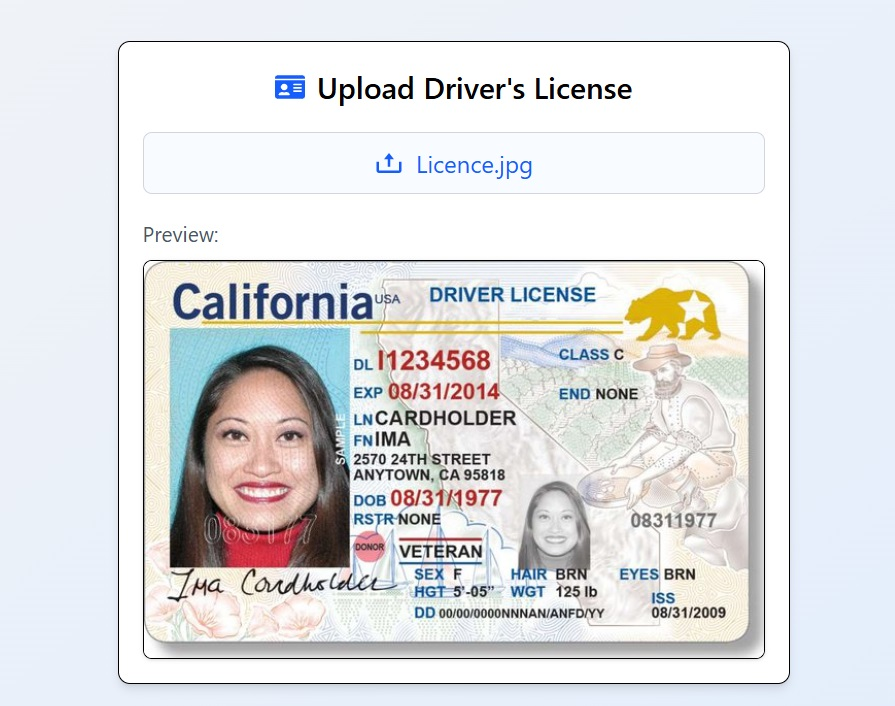
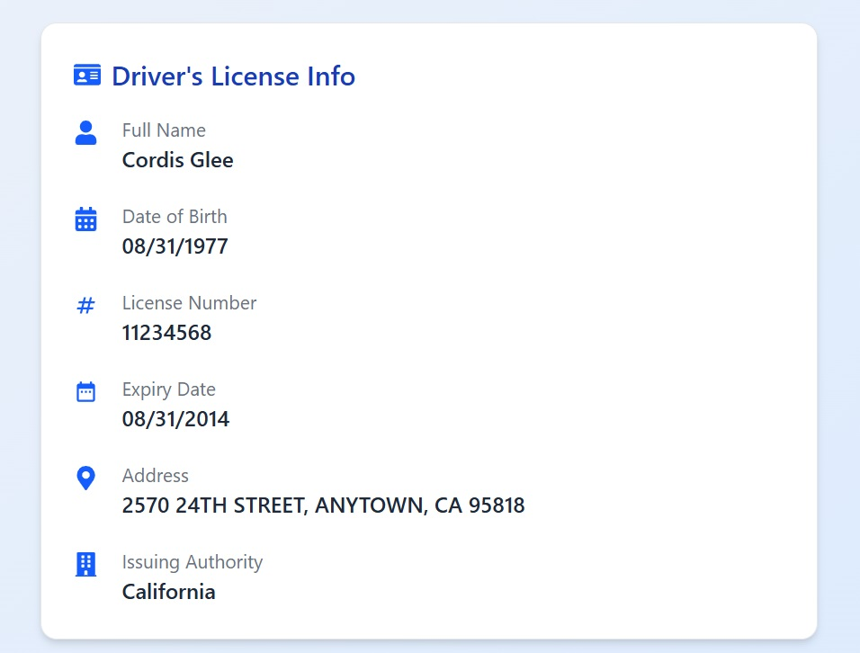

# Driving License Verification

A modern web application built with **React**, **Tailwind CSS**, and **Google Gemini AI** that allows users to upload a driver's license image and automatically extract key information using OCR and AI.

---

## 🚀 Features

- Upload driver's license image
- Extract raw text via OCR (Optical Character Recognition)
- Parse structured data using Gemini AI (text-only model)
- Display extracted info like:
  - Full Name
  - Date of Birth
  - License Number
  - Expiry Date
  - Address
  - Issuing Authority
- Elegant and responsive UI with Tailwind CSS
- Lightning-fast dev environment using Vite

---

## 🔧 Getting Started

### 1. Clone the repo

```bash
git clone https://github.com/tanujgupta18/Driving-License-Verification.git
cd Driving-License-Verification
```

### 2. Install dependencies

```bash
npm install
```

### 3. Create a `.env` file

```bash
VITE_GEMINI_API_KEY=your_gemini_api_key_here
```

> ⚠️ Keep this file **private** and don’t commit it.

### 4. Start development server

```bash
npm run dev
```

---

## 🖼️ Screenshots

| Upload License                       | Extracted Info                         |
| ------------------------------------ | -------------------------------------- |
|  |  |

---

## 🧪 Built With

- [React](https://reactjs.org/)
- [Tailwind CSS](https://tailwindcss.com/)
- [Google Gemini API](https://ai.google.dev/)
- [Vite](https://vitejs.dev/)
- [React Icons](https://react-icons.github.io/react-icons/)
